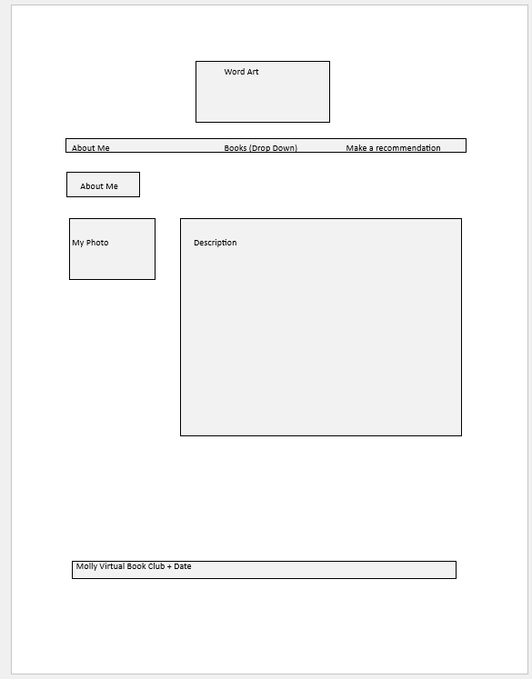
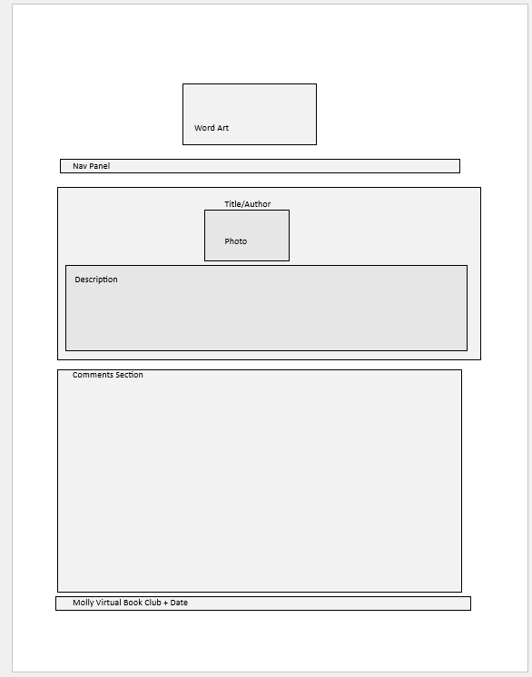
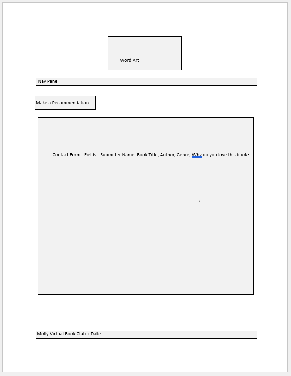

# INF 6420 - Molly's Project Website

I thought it would be fund to create a faux rendition of a virtual book club.  Forgive my bad graphics skills, things will be more even on creation. These are very simple designs.  

## Wireframes

### About Me Page

#### Header - Logo or Word Art
Navigation Menu - Will link to other topic pages
Main Content - Photo and about me section
Footer - Book Club Title and Date

### Landing Page/Book List

-Wireframe.png)

#### Header - Logo or Word Art
Navigation Menu - Will link to other topic pages
Main Content - Photos of books as links to individual pages and descriptions/reviews of each book
Footer - Book Club Title and Date

### Individual Book Pages

#### Header - Logo or Word Art
Navigation Menu - Will link to other topic pages
Main Content - Book Photo, Title, Description and Attempted Comment Section
Footer - Book Club Title and Date

### Make A Recommendation

#### Header - Logo or Word Art
Navigation Menu - Will link to other topic pages
Main Content - Going to attempt a form here that sends user input to me via email.  We will see how possible this is
Footer - Book Club Title and Date